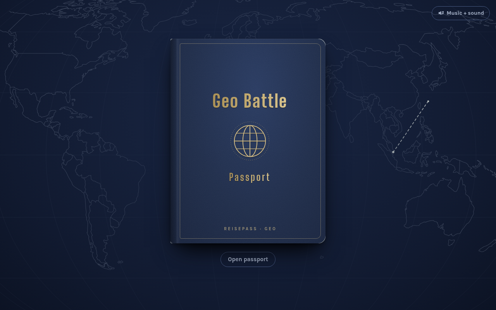
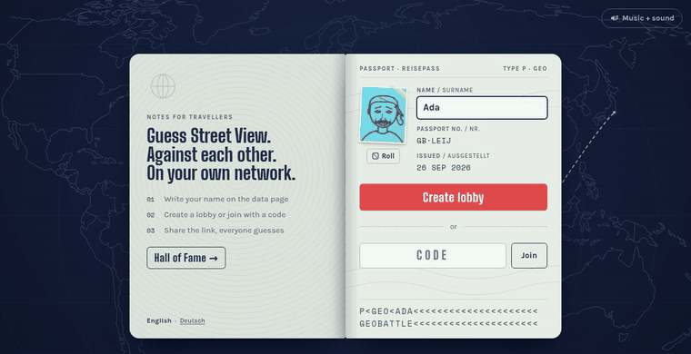
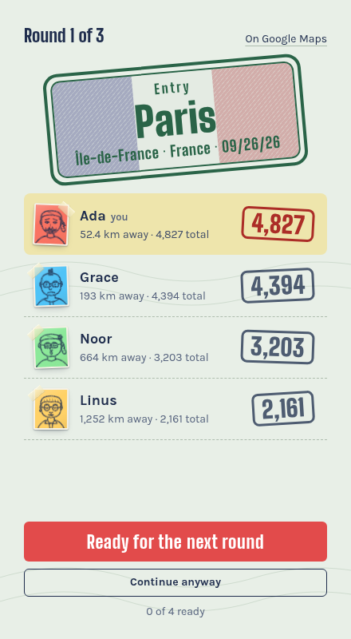
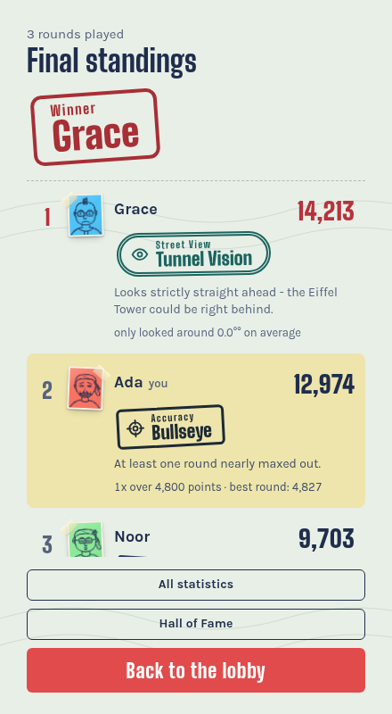
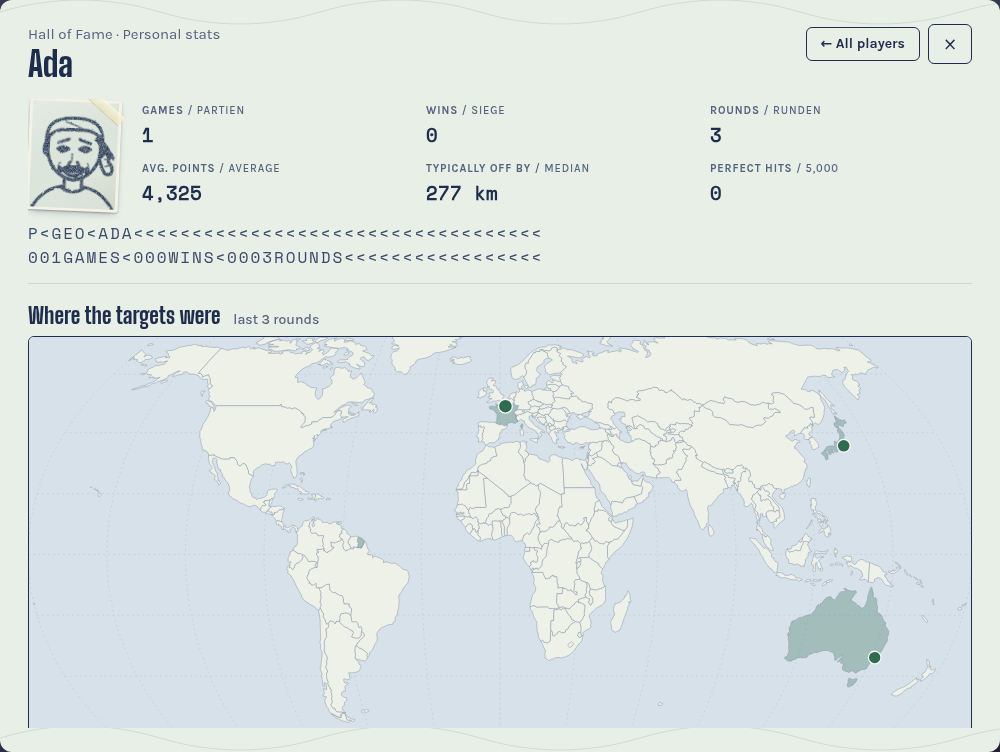

# Geo Battle

[](https://github.com/MarianBecher/geo-battler/actions/workflows/ci.yml)
[](https://claude.com/claude-code)

A GeoGuessr-style party game for your own network: one local server,
everyone joins with a room code, and the rounds run in real time over
WebSockets. Styled as a passport, complete with entry stamps, a small
sampled orchestra and the national anthem of the country you just guessed.
English and German out of the box.

```bash
pnpm install
cp .env.example .env    # add your Google Maps keys, see Setup
pnpm dev                # http://localhost:5173
```

Needs Node 22+, [pnpm](https://pnpm.io/) and two Google Maps API keys.
Realistically it costs nothing: the free allowance covers a couple of
hundred games a month (see [What it costs](#what-it-costs)).





<p align="center">
  
  
</p>



## Features

* **Lobby with a code** - whoever has the four-letter code is in; the host
  shares a ready-made link with the code in it
* **The lobby decides** - the host sets rounds and time limit; everyone votes
  on No Move / No Pan / No Zoom and picks the map (World, Europe, DACH,
  Americas, Asia, Africa, Oceania); the host can lock any of it
* **Classic, Duel, Team duel** - points over fixed rounds, or hit points
  until one player or one team is left standing
* **Everyone sees the same panorama** and starts on the same 3-2-1 countdown
* **A round ends** when everyone has submitted or time runs out. Until then
  the pin can be moved and submitted again; on timeout the last pin counts
* **The reveal** shows all pins on one map, names the place, and counts the
  GeoGuessr score up: `5000 * e^(-10 * d / 14916.862)`, max. 5,000 per round
* **Music and sound** - a travel waltz in the lobby, quiet strings while
  guessing, pizzicato ticking in the last ten seconds, a timpani roll and a
  stamp for the reveal, then the country's anthem
* **Keyboard shortcuts** - space submits, `M` keeps the map open, `R` takes
  you back to the starting point
* **Final standings with a world map** - all targets and all guesses at a
  glance, filterable by round, plus a title per player and a statistics table
* **Passport photos** - a pencil-drawn face for everyone, seeded from the
  name, rerollable in the lobby
* **Chat** - in the lobby, the reveal and on the final screen; closed during
  the round
* **Hall of Fame** - records across evenings with personal stats per player,
  the only thing that survives a server restart
* **Survives a reload** - reconnecting brings you back into the running
  round, pin included
* **Host tools and spectators** - kick, hand over the host role, pause;
  whoever joins mid-game watches the round, pins and chat first

## Setup

### 1. Create two API keys

Create a project in the [Google Cloud Console](https://console.cloud.google.com/)
and enable **three** APIs:

| API | used for | cost |
| --- | --- | --- |
| **Maps JavaScript API** | panorama + guess map in the browser | SKU *Dynamic Street View* (Pro) and *Dynamic Maps* (Essentials) |
| **Street View Static API** | location search on the server | metadata requests only -> **free, no quota** |
| **Geocoding API** | place name for the reveal | Essentials, 10,000/month free - one request per *round* |

The Geocoding API is optional: without it the reveal shows the coordinates
instead of "Montevideo, Uruguay". If it is refused, the server logs that and
pauses for five minutes before trying again - so enabling it later does not
require a restart.

> Two places to check: the API must be **enabled** in the project and
> additionally **allowed** in the *API restriction* of key 2. If the latter is
> missing, Google answers with `REQUEST_DENIED` and a hint about the key
> restriction.

Then create **two** keys. Two, because a Google key can carry only *one*
application restriction - and we have two callers.

#### Key 1 - browser (`GOOGLE_MAPS_BROWSER_KEY`)

This one goes out to the players and sits in the page source.

* **Application restriction: None**
* **API restriction:** *Maps JavaScript API* only

`None` sounds wrong but is the right choice here: a *Websites* restriction
would have to name the address the game is played on, and that changes with
every network (`192.168.0.x` at home, `10.x` at work). It is also the softest
of the screws: only browsers send an honest `Referer`, and a `localhost`
entry voids it completely.

A key in client code is **not** a secret. What carries the weight are the
other three:

1. **API restriction** to *Maps JavaScript API* - limits what the key can do
2. **daily quota** (next section) - caps the damage at 0 EUR
3. **the LAN guard in the server** - the key is only handed to private
   addresses, an open port alone is not enough

If you play permanently over a mesh VPN with a fixed hostname (see *When it
becomes regular*), switching to *Websites* makes sense:
`http://<hostname>:3000` and `http://<hostname>:3000/*`.

#### Key 2 - server (`GOOGLE_MAPS_SERVER_KEY`)

This one never leaves the server - `/api/config` only hands out key 1.

* **Application restriction:** *IP addresses* with your **public** IP (Google
  sees your router's WAN IP, not the LAN IP). With a dynamic IP from your
  provider that is a nuisance - then leave it at *None*, the key is not
  exposed anyway.
* **API restriction:** *Street View Static API* and *Geocoding API*

> For a first try, a single unrestricted key in `GOOGLE_MAPS_API_KEY` is
> enough - it is used as the fallback for both.

### 2. Set a daily quota (the real protection)

Referrer restrictions keep strangers out, but only a hard limit protects
against an accidental bill. A budget alert **caps nothing**, a quota does:

*Cloud Console -> Google Maps Platform -> Quotas -> Maps JavaScript API ->
"Requests per day" -> untick "Unlimited" -> e.g. `300`*

That closes the expensive path from above (panoramas **and** map loads both
run through the Maps JavaScript API). Do not set the Street View Static API
too tight: the metadata requests are free but may still count towards the
quota - a few hundred per day is plenty.

### 3. Install and start

Node 22 or newer and [pnpm](https://pnpm.io/) (`corepack enable` gives you
the pinned version).

```bash
pnpm install
cp .env.example .env
# fill in GOOGLE_MAPS_BROWSER_KEY and GOOGLE_MAPS_SERVER_KEY
pnpm dev
```

`pnpm dev` starts the game server on port 3000 and the Vite dev server on
port 5173, which proxies `/api` and `/ws` to the game server. Open
`http://localhost:5173`. The server prints the LAN addresses the others can
use at start-up.

For a build that runs without Vite:

```bash
pnpm build
pnpm start          # serves the built client on port 3000
```

One player creates the lobby, the others type in the code. A `?code=ABCD`
in the URL prefills the field.

> **Under WSL2** the printed `172.x` address sits behind NAT and is not
> reachable from other devices. [docs/wsl2.md](docs/wsl2.md) has the two ways
> out: mirrored networking or a port proxy.

## How the others find you

The LAN IP changes with the network, and `.local` (mDNS) is unreliable across
platforms. So the game solves it differently: **the host shares a link.**
The lobby shows a ready-made URL with the room code in it, e.g.
`http://192.168.0.199:3000/?code=BDKE`, click to copy. It comes from the
**server's** interfaces, not from the host's address bar, because the host
may have the page open via `localhost`.

If your IP is `192.168.0.199` and a colleague's is `10.14.x.x`, you sit in
different subnets and only a VPN helps. Wi-Fi with client isolation (guest
networks almost always) blocks device-to-device traffic completely.

### When it becomes regular

A mesh VPN like [Tailscale](https://tailscale.com/) gives every machine a
**fixed** address and name, independent of network and location. That solves
the finding problem and makes a *Websites* restriction on the browser key
maintainable again. The price: every player has to join the tailnet.

## Local network only

The browser key is handed exclusively to clients from private networks
(`10.x`, `172.16-31.x`, `192.168.x`, loopback, IPv6 ULA and link-local); the
same goes for the WebSocket connection. `X-Forwarded-For` is deliberately
ignored - there is no proxy in front. Whoever wants to open the server to the
outside on purpose sets `ALLOW_PUBLIC_CLIENTS=1`.

## What it costs

Every Google Maps SKU has its own free allowance: 10,000/month for
*Essentials*, 5,000 for *Pro*. What this game uses:

| Action | SKU | Amount |
| --- | --- | --- |
| Panorama per round and player | Dynamic Street View (Pro) | 5,000/month free, then USD 14 / 1,000 |
| Guess and reveal map | Dynamic Maps (Essentials) | 10,000/month free, then USD 7 / 1,000 |
| Location search on the server | Street View Metadata | **free, unlimited** |
| Place name per round | Geocoding (Essentials) | 10,000/month free, then USD 5 / 1,000 |

The two maps are built **once** per browser session; the panorama is charged
per round and player, which makes it the bottleneck:

| Line-up | Panoramas per game | Free games per month |
| --- | --- | --- |
| 4 players, 5 rounds | 20 | ~250 |
| 4 players, 10 rounds | 40 | ~125 |
| 8 players, 5 rounds | 40 | ~125 |

Beyond the free allowance a panorama costs 1.4 cents. Realistically you
never pay anything.

## Game modes

| Setting | Meaning |
| --- | --- |
| **Classic / Duel** | points over fixed rounds - or hit points until only one is standing |
| **Rounds** | 1 to 20 (classic) |
| **Hit points** | 1,000 to 20,000, default 6,000 (duel) |
| **Teams** | duel in two teams with shared hit points |
| **Time per round** | 15 s to 10 min or unlimited (`∞`) |
| **No Move** | arrows and click-to-go off - you stay at the starting point |
| **No Pan** | view direction fixed; mouse, touch and keyboard are locked |
| **No Zoom** | zoom snaps back to the start value |

The **NMPZ** button locks all three to *On* at once.

### Voting

The whole lobby votes on the three restrictions with *For* and *Against*;
the majority of votes cast wins, on a tie the current setting stays. The
host can *Lock* a restriction, which turns the vote into an on/off switch for
the host alone. No Pan only works with No Move, so a vote for No Pan votes
for No Move too. The map is a choice: everyone picks one, the most chosen
applies, without votes the world does.

### Duel

Everyone starts with the same hit points. After every round everyone loses
the difference to the **best guess of the round**. Whoever hits 0 is out;
play continues until at most one is left. From round 6 damage rises: x1.5,
x2, then 0.5 more per round. Whoever is out may keep guessing for fun.
Because the number of rounds is open, the server tops up locations during
the reveal.

### Team duel

Red against Blue. Each team has **one** HP bar; per round the team's
**average points** count, not the sum. Player colours match the team. A win
counts in the Hall of Fame for everyone in the team.

## Languages

The game ships in English and German. The language is picked from the
browser's preference and can be switched inside the passport cover; the
choice is stored per browser. Everything the player reads lives in
`apps/web/src/i18n/<lang>.ts`; the English dictionary defines the keys and
the compiler checks every other language against it. The server never sends
prose: errors, titles, statistics and pack names go over the wire as typed
codes and raw numbers (`packages/shared`), and the client translates them.
To add a language, copy `en.ts`, translate the values, and register it in
`apps/web/src/i18n/index.ts`.

Place names in the reveal come from Google's reverse geocoding and are
shared by everyone in the room; their language is a server setting
(`GEOCODE_LANGUAGE`, default `en`).

## Music and sound

Real orchestra samples (VSCO-2 Community Edition, CC0), played by the
[tiny-orchestra](https://github.com/MarianBecher/tiny-orchestra) sampler.
The samples ship inside that npm package; `pnpm install` copies them into
`apps/web/public/audio/` (see `apps/web/scripts/copy-assets.mjs`), so
nothing is fetched from a CDN at runtime.

The speaker button cycles through **Music + sound**, **Sound only** and
**Sound off**; the setting lives in `localStorage`. Until the samples are
loaded, small synth effects fill in.

| Situation | what plays |
| --- | --- |
| Home, lobby | travel waltz: harp and pizzicato, flute on top, oboe on the second pass |
| Guessing | wide string pads, rippling harp, motif fragments in oboe and horn |
| Last 30 s of a round | a call to attention of crash, bass drum and brass, then the guessing theme steps back for driving strings, timpani, drums and the motif of both themes in the horns - growing in three stages until the trumpets take it up as time runs out |
| Reveal | timpani roll, the entry stamp lands, then a dominant chord leads into the **national anthem of the country**, then the waltz returns |
| Final | silence first so the fanfare stands alone, then the waltz again |

**Anthems:** the note data comes from
[anthem-scores](https://github.com/MarianBecher/anthem-scores) (npm package
of the same name), converted from freely licensed scores on Wikimedia; the
orchestration lives in `apps/web/src/audio/music.ts`. Anthems whose
composition is still under copyright are not included; then, and on the open
sea, a short cadence plays instead.

Anthems you are not allowed to redistribute can still be played on your own
machine: put them into `apps/web/anthems.local/` (same JSON format, plus an
`index.json` listing them) and run `pnpm --filter @geo-battler/web assets`.
They are merged into the served index, the free package version wins where
both exist. The folder and any `restricted-*.json` are gitignored and
dockerignored, so they never reach the repository or an image.

**Jukebox:** `/jukebox` plays the themes, the effects and every anthem at
the press of a button. Not linked anywhere, open it directly.

## Hall of Fame

After every finished game the server writes the records to `data/hall.json`
(elsewhere via `HALL_FILE`): best guess of all time, best round, best game,
and per player games, wins, average, perfect hits and the favourite title.
Records and averages only count on the world map - on a small pack every
guess is closer. A click on a name opens the personal stats: a printed world
map of all targets, strengths by continent and country, and the form over
the last 30 games. Players are recognised by name (lower-cased). Writes go
through a temporary file and `rename`.

```bash
pnpm --filter @geo-battler/server hall:clear   # or simply delete data/hall.json
```

## Layout

A pnpm workspace with three packages:

```
packages/shared/   types and constants both sides import: the WebSocket
                   protocol, settings and limits, error codes, title and fact
                   ids, metric keys, scoring
apps/server/       Node + Hono + ws: rooms, location search, geocoding,
                   titles, Hall of Fame; serves the built client in production
apps/web/          Vite + TypeScript, no framework: the passport UI, i18n,
                   Google Maps views, the printed world map, the orchestra
```

```
apps/server/src/
  index.ts      bootstrap: Hono on Node's http server, WebSockets on the same port
  http.ts       /api/config, /api/hall, static client in production
  ws.ts         message routing, catch-up on reconnect
  room.ts       room state machine and the rules of the game
  locations.ts  random places from weighted regions + coverage check, map packs
  geocode.ts    place name for the coordinates of a round
  titles.ts     title catalogue and statistics table
  hall.ts       records across evenings, as JSON on disk
  stats.ts      what is recorded per player and round
  continents.ts country and coordinate -> continent
  errors.ts     error codes the client translates
  env.ts        .env and settings
apps/web/src/
  main.ts       wires screens to the socket, boots the page
  screens/      home, lobby, game, reveal, final, hall
  i18n/         translation helper and dictionaries
  maps/         Google Maps loader and views, the printed world map
  audio/        sound modes, effects, the scores, synth fallback
  ui/           passport animation, atlas backdrop, confetti, speaker button
  photo.ts      passport photos via pencil-faces
  style.css
```

Dependencies published from this project's sister repos:
[pencil-faces](https://github.com/MarianBecher/pencil-faces) (the drawn
photos), [tiny-orchestra](https://github.com/MarianBecher/tiny-orchestra)
and [anthem-scores](https://github.com/MarianBecher/anthem-scores).

### Development

```bash
pnpm check   # typecheck, lint, tests for every package
pnpm test    # Vitest across the workspace
pnpm build   # server bundle (esbuild) and client (Vite)
```

A `Makefile` wraps the same commands: `make install`, `make dev`,
`make build`, `make start`, `make check`, `make docker-build` and so on;
`make help` lists them all.

The server tests play whole games against an injected location finder; the
client tests cover the pure parts (formatting, projections, scores). Pushes
to `main` and pull requests run the same checks on GitHub Actions.

### Docker

```bash
docker build -t geo-battler .
docker run --rm -p 3000:3000 --env-file .env -v geo-battler-data:/app/data geo-battler
```

### How the places are found

`locations.ts` rolls a point from a weighted list of well-covered regions and
asks the Street View Metadata API whether a panorama lies within 20 km. No
hit? Roll again. Metadata requests are free, so this is cheaper than a
bundled list of places and stays current by itself. When movement is
allowed, a find must also be official Google coverage with a neighbouring
panorama, so nobody lands on an isolated photo sphere.

### WebSocket protocol

Typed in `packages/shared/src/protocol.ts`: every message the client sends
(`create`, `join`, `pin`, `guess`, `vote`, `chat`, ...) and every answer from
the server (`room`, `round`, `pins`, `reveal`, `final`, ...). `round` carries
the panorama id but not the answer; the coordinates of the place leave the
server only with `reveal`. Whoever fishes the panorama id out of the dev
tools can still cheat - against friends at the same table this is enough.

## Limits

* Rooms live in memory only; a server restart ends everything except the
  Hall of Fame.
* Disconnected players keep their seat for two minutes; empty rooms are
  cleaned up after ten; max. 16 players per room.
* No HTTPS. Fine on the LAN, do not run it on the internet.

## How this was made

The code, tests and docs were written by Claude (Anthropic) with Claude
Code, directed and reviewed by me. CI runs the checks and the build on every
push.

## License and credits

The code is under the [MIT License](LICENSE). Bundled third-party material
keeps its own license:

* **Orchestra samples** - [VSCO-2 Community Edition](https://github.com/sgossner/VSCO-2-CE)
  by Versilian Studios, CC0 1.0, via tiny-orchestra
* **Anthem note data** - public domain, CC0 or CC BY-SA 4.0 per file, listed
  in the anthem-scores package's `CREDITS.md`
* **Flags** - [flag-icons](https://github.com/lipis/flag-icons) by Panayiotis
  Lipiridis, MIT, see `apps/web/public/flags/LICENSE`
* **Country outlines** - [Natural Earth](https://www.naturalearthdata.com/)
  1:110m, public domain
* **Fonts** - Big Shoulders Display, Karla and Space Mono via Google Fonts
  (SIL Open Font License)

Google Maps, Street View and the Geocoding API are used under the
[Google Maps Platform Terms of Service](https://cloud.google.com/maps-platform/terms);
bring your own keys.
